 

# Processing Topology Suite

<h3 align="center"> 🚧 Under Construction 🚧 </h3>

---
PTS is a library for geometric operations in Processing.

Most methods operate on PShapes, and return PShapes (where applicable).

The library is stateless: methods are static.

A library for shapes in Processing:

- Predicates
  - >Does
- Metrics
  - >What is the area of this polygon?
- Geometric Computation
  - > The union of these two shapes

PTS wraps JTS, enabling its methods to be applied to Processing's `PShape` objects. Beyond that, PTS provides other geometry __ such as splines.

[Contents from https://doc.cgal.org/latest/Manual/packages.html]

## PShapes

- Boolean operations: union, difference, intersection, etc. (/OVERLAY OPERATIONS)
- Shape Boundaries
- Smoothing
- Simplification
- Area, centroid, etc.

### SPATIAL RELATIONSHIPS

- Within
- Contains
###  BUFFERS

### POLYGONIZATION

### Geometry methods
- Spatial Predicates, relate()
- Overlay ops, buffer(), convexHull()
- Metrics

The library is split into a handful of classes as detailed below.

## **Contour**
*Methods to produce a variety of geometric contour lines within shapes.*
### Medial Axis

### Dissolved Medial Axis
A medial axis where small line segments are dissolved into larger, straighter ones.

### Straight Skeleton

  

### Isolines (topographic contour lines)
Isolines from intra-shape euclidean distance or point sets.

  
  

### Mitered Offset Curves
Inner and exterior mitered offset curves; based on *miter*, *bevel* or *round* offset styles. 

  
  

### Voronoi Diagram

  
  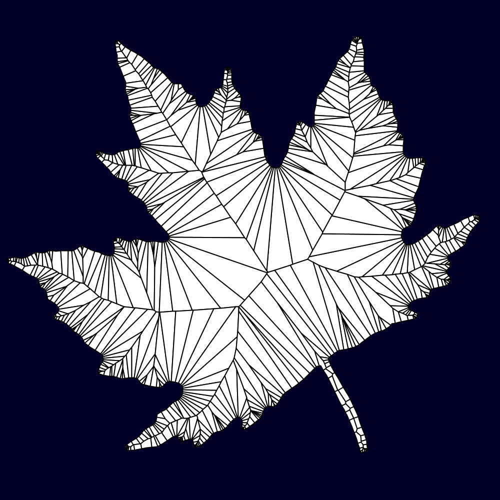

### Delaunay Triangulation
Constrained & refined *Delaunay triangulation* of shapes and point sets.

  
  

### Poisson Delaunay Triangulation
*Delaunay triangulation* of shapes where *steiner points* generated by poisson disk sampling are inserted.

### Earcut Triangulation

  
  

## **Morphology**
*Methods to morph shapes (topology)*
### Buffer
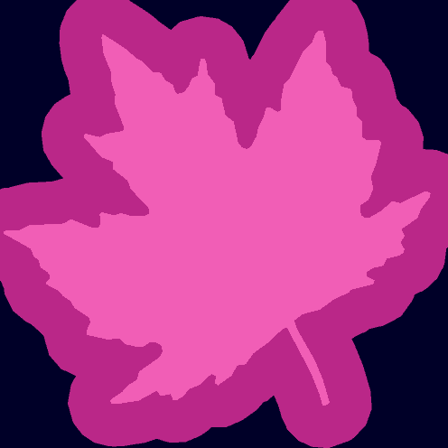

### Erosion-Dilation
A negative followed by a positive buffer (in one operation).

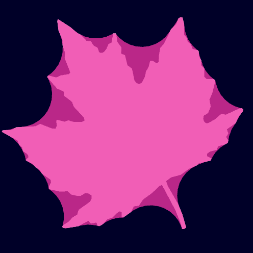

### Minkowski Addition
Minkowski sum and difference (a.k.a buffer one shape using another shape; pictured: buffering using a rotating & growing triangle).

  
  

### Simplification

### Smoothing

### Concave Hull
Concave hull of point sets.

  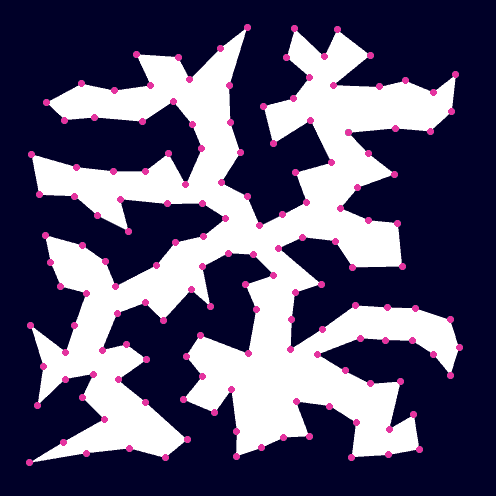
  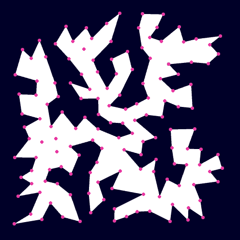

### Convex Hull
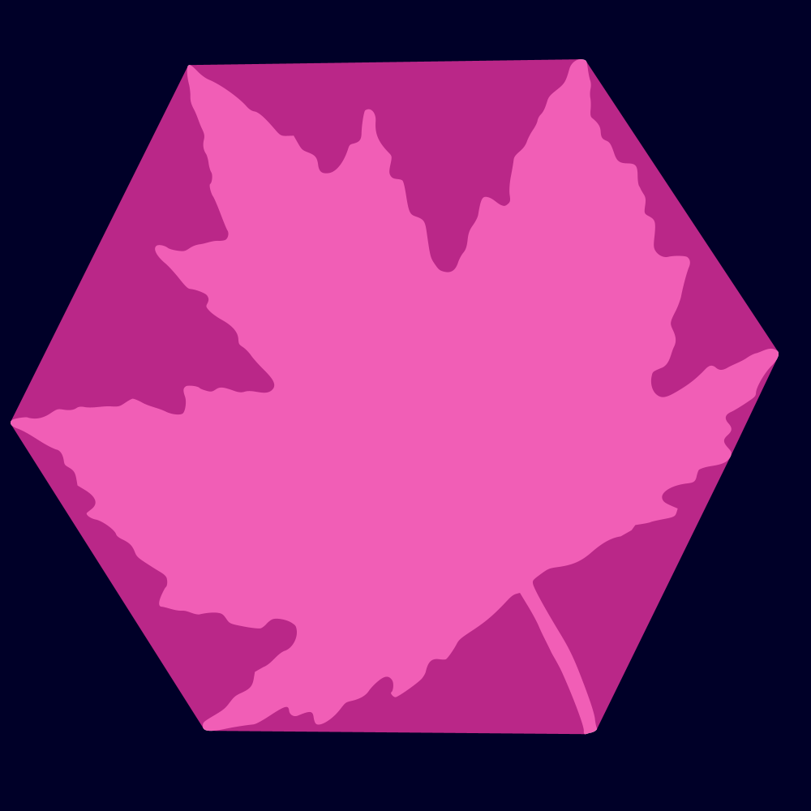

### Snap Hull
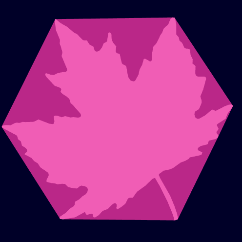

## **Geometry Processing**

### Point on Perimeter
Find a point some fraction along the perimeter of a shape (with perpendicular offset).

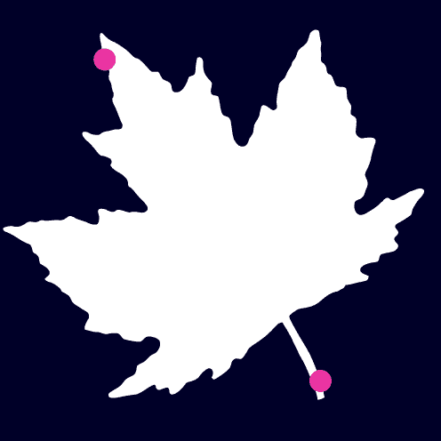

### Points on Perimeter
Find *N* points (evenly distributed) along the perimeter of a shape, or points every *D* distance (with optional perpendicular offset).

  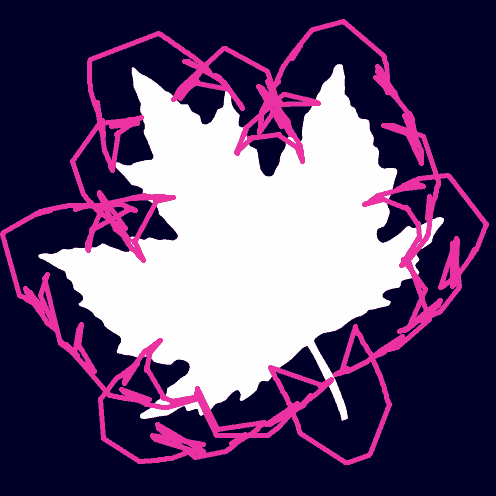
  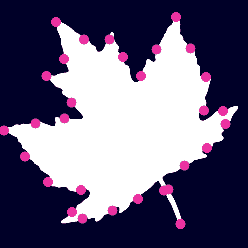

### Partitioning
Partition a shape into simple (convex) polygons.

  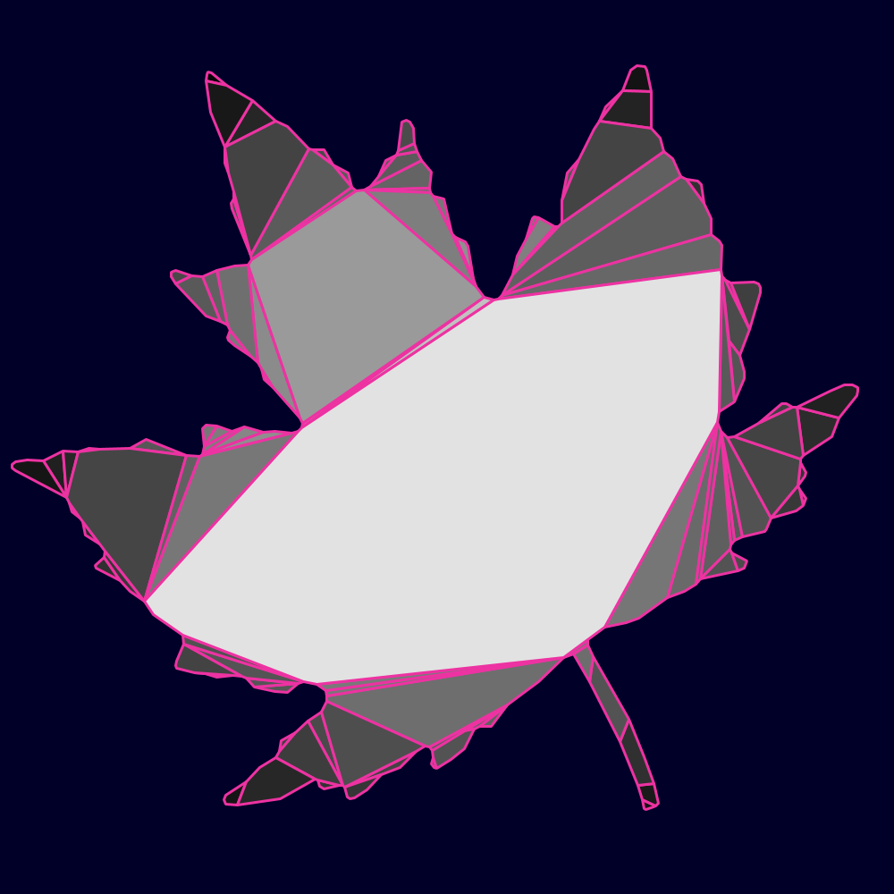
  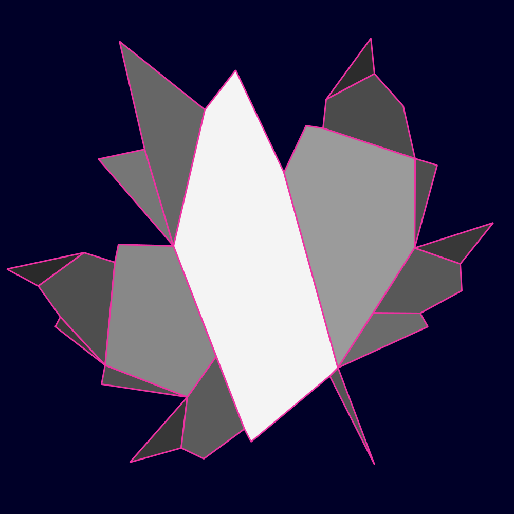

## **Geometric Optimization**

### Closest Point
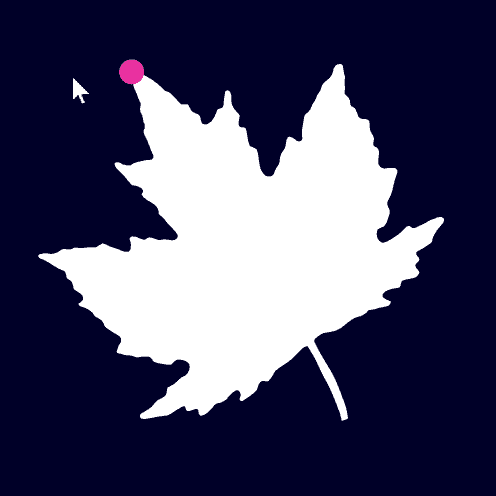

### Maximum Inscribed Circle
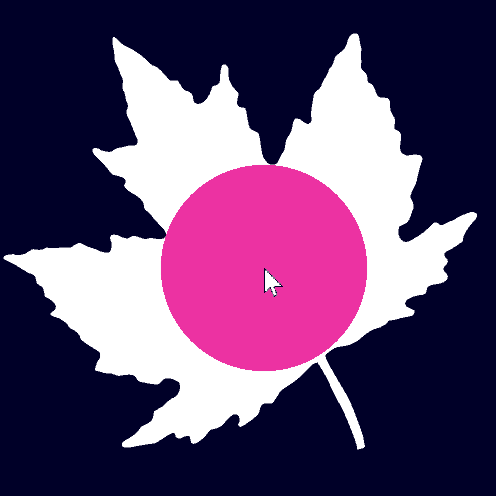

### Minimum Bounding Circle
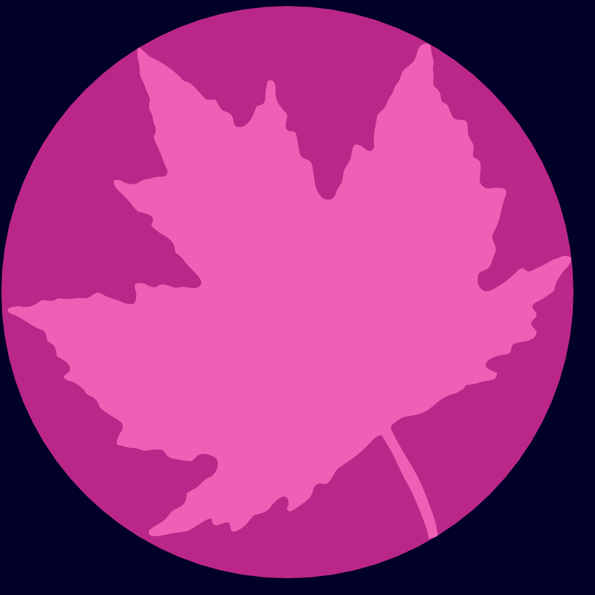

### Minimum Bounding Rectangle
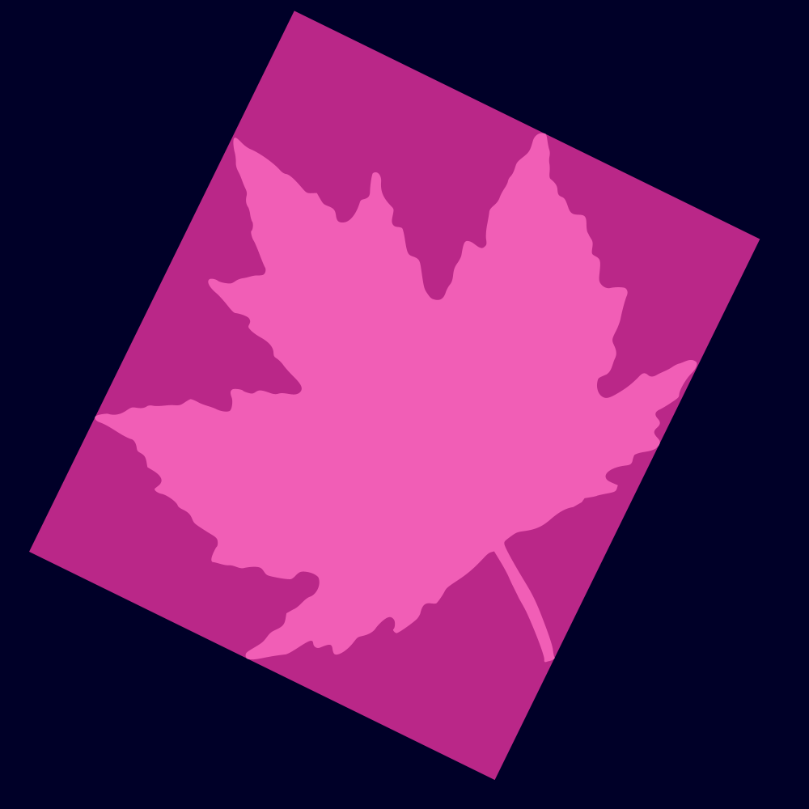

## **Transformation**
PTS provides transformation methods much like Processing's. Notably these methods affect the vertex coordinates of PShapes, unlike Processing's equivalent methods that affect the affine matrix of shapes only (and thereby leave vertex coordinates in-tact).

Methods beyond those offered in Processing are illustrated here:

### Rotate Around
Rotate a shape around its centroid, or some other point.

  
  

### Translate To
Translate a shape such that its centroid matches some position.

### Touch Scale
Scale one shape such that it touches another.

### Homothetic Transformation
Projection-transform a shape with respect to a fixed point.

## **Geometric Predicates**

### Intersects
Do shapes intersect with each other?

### Contains Shape
Does one shape fully contain another?

### Contains Point
For individual points and point sets.

  

### Covers
Less strict that contains

### Predicates