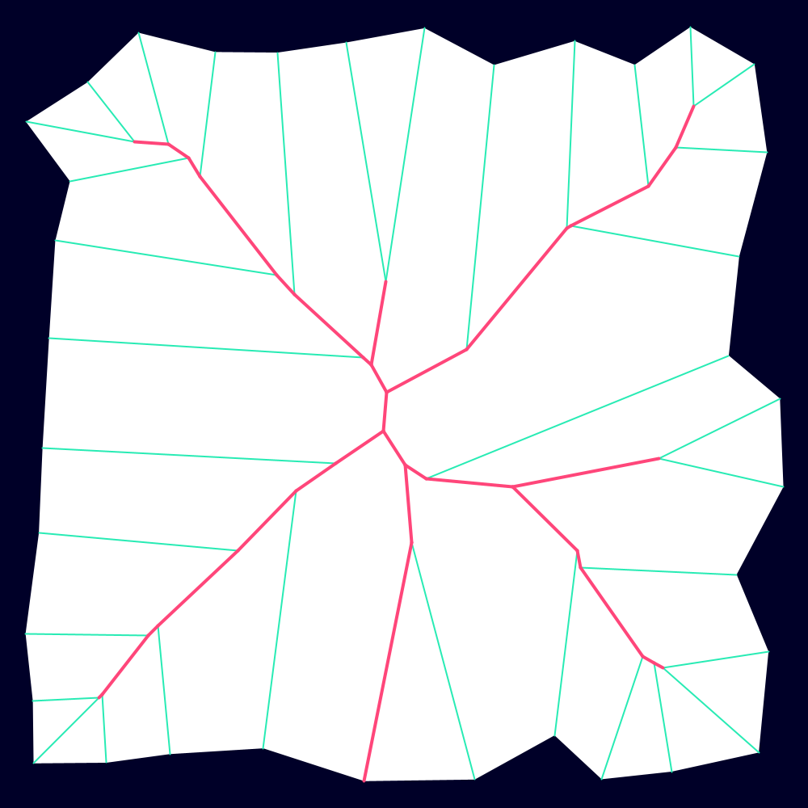

# Processing Topology Suite

<h3 align="center"> 🚧 Under Construction 🚧 </h3>

---

A library for shapes in Processing:

- Predicates
- Metrics
- Geometric Computation

PTS wraps JTS, enabling its methods to be applied to Processing's `PShape` objects. Beyond that, PTS provides other geometry __ such as splines.

[Contents from https://doc.cgal.org/latest/Manual/packages.html]

The library is split into a handful of classes as detailed below.

## Contour
Methods to produce shape contour lines.
### Medial Axis

### Dissolved Medial Axis
A medial axis where small line segments are dissolved into larger, straighter ones.

### Straight Skeleton

### Uniform straight skeleton
...

### Isolines (topographic contour lines)

  

### Mitered Offset Curves
Inner and exterior mitered offset curves; based on *miter*, *bevel* or *round* offset styles. 

  
  

## Morphology
Methods to morph shapes (topology)
### Buffer

### Mink sum + diff

### PShapes

- Boolean operations: union, difference, intersection, etc. (/OVERLAY OPERATIONS)
- Shape Boundaries
- Smoothing
- Simplification
- Area, centroid, etc.

### SPATIAL RELATIONSHIPS

- Within
- Contains
###  BUFFERS

### POLYGONIZATION

### Geometry methods
- Spatial Predicates, relate()
- Overlay ops, buffer(), convexHull()
- Metrics

## Geometry Processing

### Point on Perimeter

### Points on Perimeter

- Noding & Polygonization
- Simplification
- Linear Referencing

### Hulls
- Concave
- Convex
- Snap

### Geometric Optimization
- Bounding Volumes (enclosing circle)
- Optimal Distances

### Fields/ Point Sets

- Voronoi
- Poisson-Disc

## Libraries

- [OS_Minkowski_Sum_Diff
](https://github.com/OrdnanceSurvey/OS_Minkowski_Sum_Diff)
- [JTS](https://github.com/locationtech/jts)

Shortcomings with JTS native triangulation (`DelaunayTriangulationBuilder`):

- Doesn't respect concave shapes/holes (which arises from computing triangulation of the vertices only, not edges) (effectively triangulates the convex hull)
- No refinement: comparison [here](http://www.cs.cmu.edu/~quake/triangle.quality.html)
  - Long, thin triangles (bad angles)
  - Large difference (non-uniform) in triangle areas
  - No way to sub-divide without 
  - Many triangles may share one boundary vertex