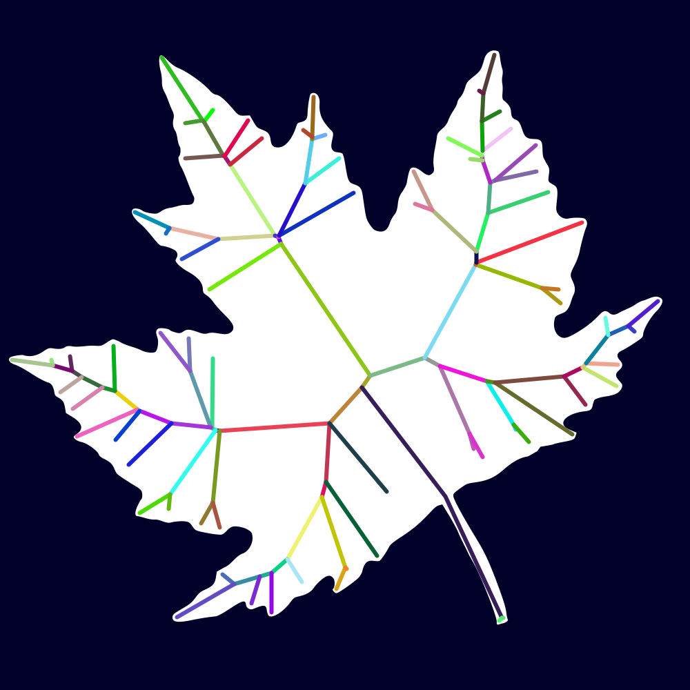
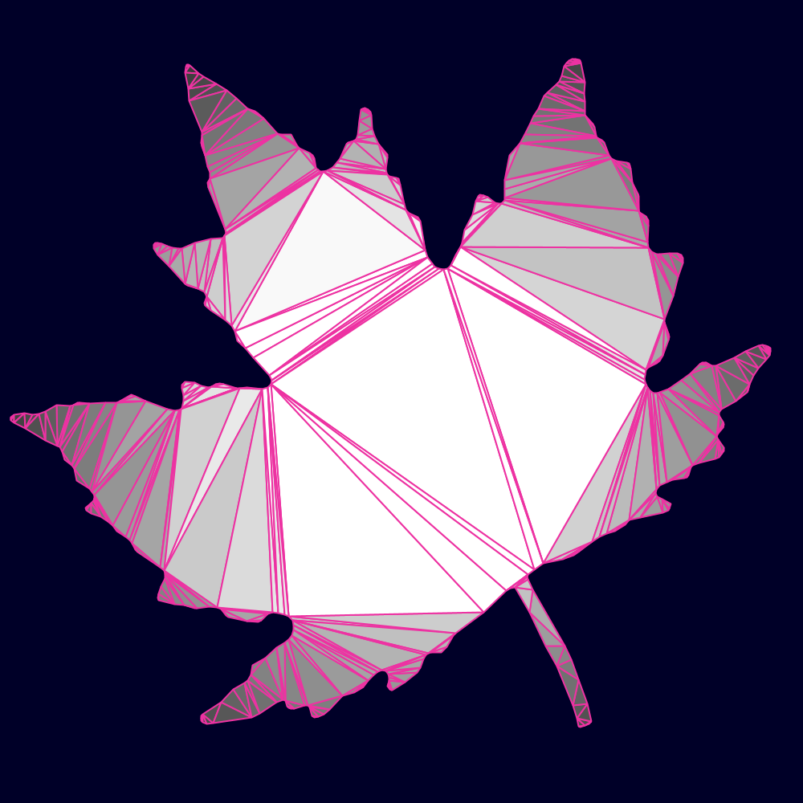
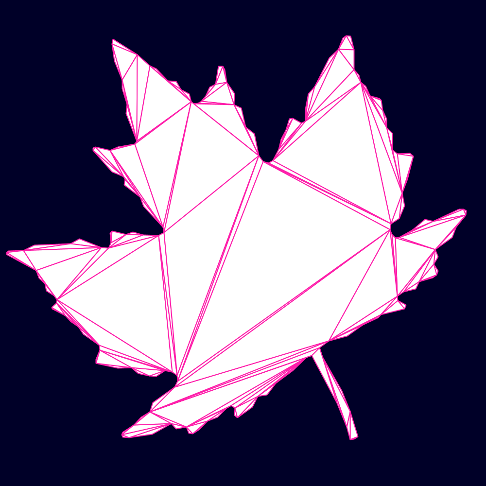
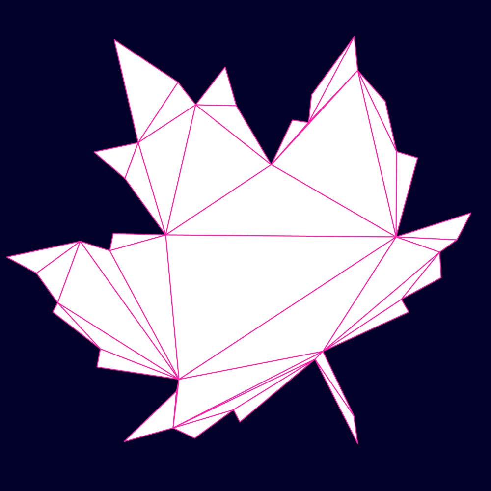
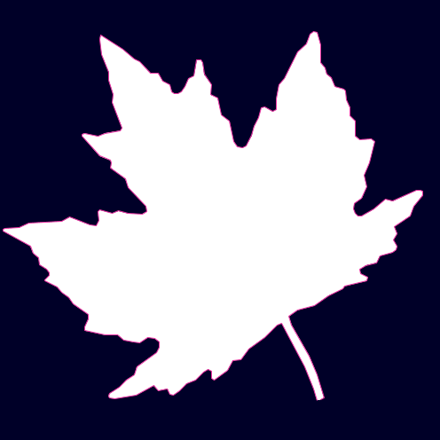
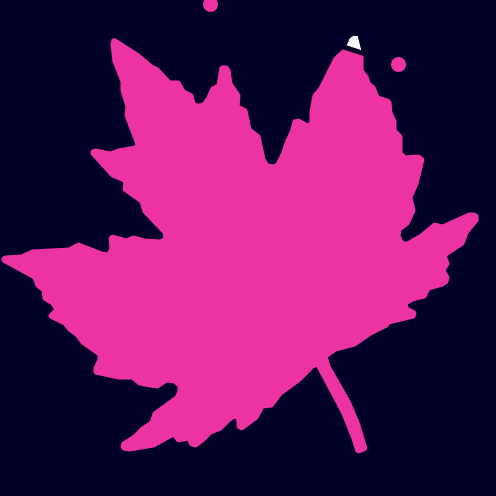
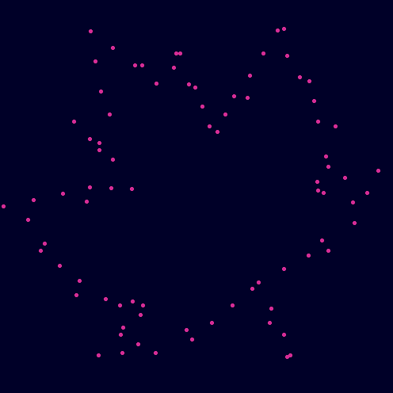

[](https://jitpack.io/#micycle1/PGS) [](https://sonarcloud.io/dashboard?id=micycle1_PTS)

# Processing Geometry Suite

*Processing Geometry Suite* is a software project that provides easy access to geometric algorithms in the form of a [Processing](https://processing.org/) library.

Methods in the library are static, and most of them take in and return [`PShape`](https://processing.org/reference/PShape.html) objects.

Docs are hosted via *GitHub Pages* [here]().

## Installation

<details><summary>Processing — Quick</summary>
<p>

Download the latest *PGS.jar* from [releases](https://github.com/micycle1/PGS/releases) and drag-and-drop it onto the Processing IDE.
</p>
</details>

<details><summary>Processing — Permanent</summary>
<p>

Download .zip and extract it to `Documents\Processing\libraries`.
</p>
</details>

<details><summary>Maven/Gradle</summary>
<p>

You can use the library in a Maven or Gradle project via [Jitpack](https://jitpack.io/#micycle1/PGS). Hosted as a artifact via Jitpack. With this you can use PGS in a Maven or Gradle Java project outside the Processing IDE.
</p>
</details>


## Example

```
import micycle.pgs.*;
import java.util.List;

PShape polygon;

void setup() {
  size(800, 800, FX2D);
  polygon = PGS.randomPolygon(6, width, height);
}

void draw() {
  background(0, 0, 40);

  PShape inverse =  PGSShapeBoolean.complement(polygon, width, height);
  inverse.setFill(color(0, 90, 200));
  shape(inverse);
  
  PShape smaller = PGSMorphology.buffer(polygon, -30);
  List<PVector> trianglePoints = PGSTriangulation.delaunayTriangulation(smaller, null, true, 4, true);
  beginShape(TRIANGLES);
  strokeWeight(1);
  stroke(0);
  for (int i = 0; i < trianglePoints.size(); i += 3) {
    fill(trianglePoints.get(i).x % 255, trianglePoints.get(i).y % 255, 50);
    vertex(trianglePoints.get(i).x, trianglePoints.get(i).y);
    vertex(trianglePoints.get(i + 1).x, trianglePoints.get(i + 1).y);
    vertex(trianglePoints.get(i + 2).x, trianglePoints.get(i + 2).y);
  }
  endShape();
  
  PVector closest = PGSGeometricOptimisation.closestPoint(inverse, new PVector(mouseX, mouseY));
  strokeWeight(10);
  stroke(255);
  point(closest.x, closest.y);
}
```

## **Overview**

Much of the functionality (but by no means all) is exemplified below.

## *2D Boolean Operations*
*Boolean set-operations on shapes.*

### Union


### Intersection


### Subtraction


### Symmetric Difference


### Complement


## *Transformation*
*These methods affect the vertex coordinates of PShapes, unlike Processing's transform methods that affect the affine matrix of shapes only (and thereby leave vertex coordinates in-tact).*

*Methods beyond those offered in Processing are illustrated here:*

### Rotate Around
Rotate a shape around its centroid, or some other point.

<p float="middle">
  
  
</p>

### Translate To
Translate a shape such that its centroid matches some position.


### Touch Scale
Scale one shape such that it touches another.


### Homothetic Transformation
Projection-transform a shape with respect to a fixed point.


## *Geometric Predicates & Metrics*

### Intersects
Do shapes intersect with each other?


### Contains Shape
Does one shape fully contain another?


### Contains Point
For individual points and point sets.
<p float="middle">
  
</p>


### Metrics
* Length
* Circularity
* Similarity
* Holes
* Simple?
* Convex?
* Distance
* Area
* Centroid

## *Contour*
*Methods to produce a variety of geometric contours within shapes.*
### Medial Axis


### Dissolved Medial Axis
A medial axis where small line segments are dissolved into larger, straighter ones.



### Straight Skeleton
<p float="middle">
  
</p>

### Isolines (topographic contour lines)
Isolines from intra-shape euclidean distance, or point sets.
<p float="middle">
  
  
</p>


### Offset Curves
Inner and exterior offset curves; based on *miter*, *bevel* or *round* offset styles. 

<p float="middle">
  
  
</p>

### Voronoi Diagram
<p float="middle">
  
  
</p>

### Circle Site Voronoi
Circle-site Voronoi via point-site approximation. Use additional optimisation beyond the general diagram. 

...

### Delaunay Triangulation
Constrained & refined *Delaunay triangulation* of shapes and point sets.

<p float="middle">
  
  
</p>

### Poisson Delaunay Triangulation
*Delaunay triangulation* of shapes where *steiner points* generated by poisson disk sampling are inserted.


### Earcut Triangulation
<p float="middle">
  
  
</p>

## *Morphology*
*Methods to morph shapes in different ways and create shapes from other shapes or point sets.*
### Buffer


### Erosion-Dilation
A negative followed by a positive buffer (in one operation).


### Minkowski Addition
Minkowski sum and difference (a.k.a buffer one shape using another shape; pictured: buffering using a rotating & growing triangle).
<p float="middle">
  
  
</p>

### Simplification


### Smoothing


### Rounding

<p float="middle">
  
  
</p>


### Concave Hull
Concave hull of point sets.
<p float="middle">
  
  
</p>

### Convex Hull


### Snap Hull


## *Geometry Processing*

### Point on Perimeter
Find a point some fraction along the perimeter of a shape (with perpendicular offset).


### Points on Perimeter
Find *N* points (evenly distributed) along the perimeter of a shape, or points every *D* distance (with optional perpendicular offset).

<p float="middle">
  
  
</p>

### Partitioning
Partition a shape into simple (convex) polygons.

<p float="middle">
  
  
</p>

### Splitting
Subdivide (recursively) a shape into quadrants



### Slicing
Slice a shape in two along a given line



### Densification


## *Geometric Optimization*

### Closest Point


### Maximum Inscribed Circle


### Minimum Bounding Circle


### Minimum Bounding Rectangle


## *Assorted*

### Supercircle
Generate *supercircle* PShapes, using a configurable constant.


### Random Polygon
Generate a random convex n-gon

