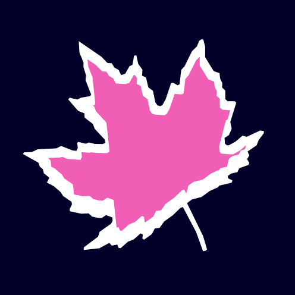
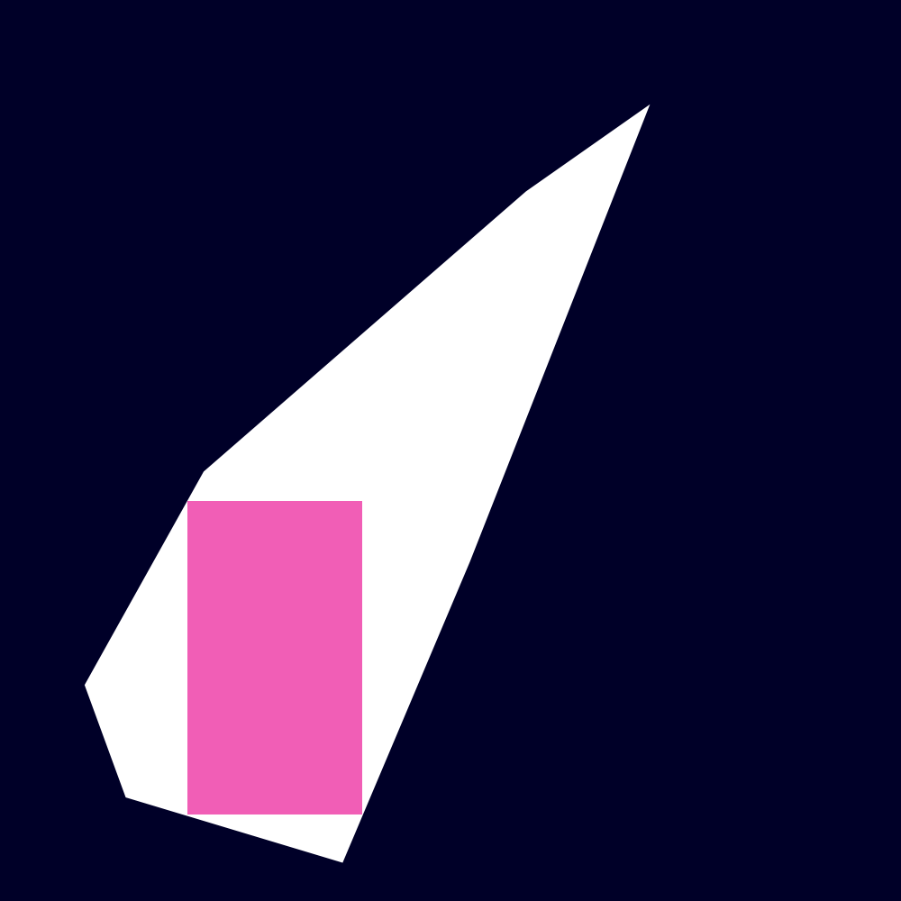
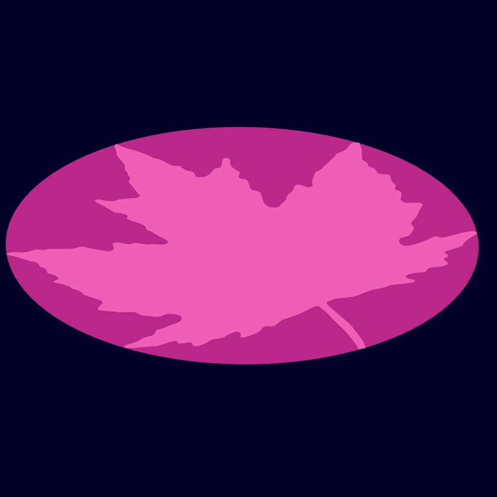

[](https://jitpack.io/#micycle1/PGS) [](https://sonarcloud.io/dashboard?id=micycle1_PTS)

# Processing Geometry Suite

*Processing Geometry Suite* is a software project that provides easy access to 2D geometric algorithms in the form of a [Processing](https://processing.org/) library.

The focus of the library is on visualisation rather than providing underlying data structures. To this end all methods in the library are static and most of them take in and return [`PShapes`](https://processing.org/reference/PShape.html) or [`PVectors`](https://processing.org/reference/PVector.html).

Docs are hosted via *GitHub Pages* [here](https://micycle1.github.io/PGS/).

## Installation

<details><summary>Processing IDE — Quick</summary>
<p>

Download the latest *PGS.jar* from [releases](https://github.com/micycle1/PGS/releases) and simply drag-and-drop it onto the [Processing IDE](https://processing.org/reference/environment/).
</p>
</details>

<details><summary>Processing IDE — Permanent</summary>
<p>

Download this repo as a .zip (via *Code>Download ZIP*) and extract it to `Documents\Processing\libraries`.
</p>
</details>

<details><summary>Maven/Gradle</summary>
<p>

PGS is hosted as an artifact for use in Maven or Gradle projects via [Jitpack](https://jitpack.io/#micycle1/PGS) — follow the instructions there (very easy). 
</p>
</details>


## Example

```
import micycle.pgs.*;
import java.util.List;

PShape polygon;

void setup() {
  size(800, 800, FX2D);
  polygon = PGS.randomPolygon(6, width, height);
}

void draw() {
  background(0, 0, 40);

  PShape inverse =  PGS_ShapeBoolean.complement(polygon, width, height);
  inverse.setFill(color(0, 90, 200));
  shape(inverse);
  
  PShape smaller = PGS_Morphology.buffer(polygon, -30);
  List<PVector> trianglePoints = PGS_Triangulation.delaunayTriangulationPoints(smaller, null, true, 4, true);
  beginShape(TRIANGLES);
  strokeWeight(1);
  stroke(0);
  for (int i = 0; i < trianglePoints.size(); i += 3) {
    fill(trianglePoints.get(i).x % 255, trianglePoints.get(i).y % 255, 50);
    vertex(trianglePoints.get(i).x, trianglePoints.get(i).y);
    vertex(trianglePoints.get(i + 1).x, trianglePoints.get(i + 1).y);
    vertex(trianglePoints.get(i + 2).x, trianglePoints.get(i + 2).y);
  }
  endShape();
  
  PVector closest = PGS_Optimisation.closestPoint(inverse, new PVector(mouseX, mouseY));
  strokeWeight(10);
  stroke(255);
  point(closest.x, closest.y);
}
```

## **Overview**

Library functionality is split over the following classes:

* `PGS_Construction`
  * Construct uncommon 2D primitives
* `PGS_Contour`
  * Methods that produce various contours from shapes: medial axes, straight skeletons, offset curves, etc.
* `PGS_Conversion`
  * Conversion between PShapes and JTS Geometries 
* `PGS_Morphology`
  * Methods that affect the geometry or topology of shapes (buffering, simplification, smoothing, etc.)
* `PGS_Optimsation`
  * Solve geometric optimisation problems, such as finding the maximum inscribed circle, or the closest vertex to a coordinate
* `PGS_Processing`
  * Methods that process a shape in some way: compute hulls, partition, slice, etc. 
* `PGS_ShapeBoolean`
  * Boolean set-operations for 2D shapes
* `PGS_ShapePredicates`
  * Various shape metrics (area, circularity, etc.) and predicates (*"do these shapes intersect?"*)
* `PGS_Transformation`
  * Various geometric and affine transformations that affect vertex coordinates
* `PGS_Triangulation`
  * Delaunay triangulation (constrained and refined) and earcut triangulation of shapes and point sets
* `PGS_Voronoi`
  * Voronoi Diagrams of shapes and point sets


Much of the functionality (but by no means all) is exemplified below:

## *2D Boolean Operations*
*Boolean set-operations on shapes.*

### Union


### Intersection


### Subtraction


### Symmetric Difference


### Complement


## *Transformation*
*PGS transformation methods affect the vertex coordinates of PShapes, unlike Processing's transform methods that affect the affine matrix of shapes only (and thereby leave vertex coordinates in-tact).*

*Only methods beyond those offered in Processing are illustrated below.*

### Rotate Around
Rotate a shape around its centroid or an arbitrary point.

<p float="middle">
  
  
</p>

### Translate To
Translate a shape such that its centroid matches some position.


### Touch Scale
Scale one shape such that it touches another.


### Homothetic Transformation
Projection-transform a shape with respect to a fixed point.


## *Geometric Predicates & Metrics*

### Intersects
Do shapes intersect with each other?


### Contains Shape
Does one shape fully contain another?


### Contains Point
For individual points and point sets.
<p float="middle">
  
</p>


### Metrics
* Length
* Circularity
* Similarity
* Holes
* Is simple?
* Is convex?
* Distance
* Area
* Centroid

## *Contour*
*Methods to produce a variety of geometric contours within shapes.*
### Medial Axis
Medial axis transform with feature pruning via distance, area or *axial angle*. 

<p float="middle">
  
  
</p>

### Straight Skeleton
<p float="middle">
  
</p>

### Isolines (topographic contour lines)
Isolines from intra-shape euclidean distance, or point sets.

<p float="middle">
  
  
</p>


### Offset Curves
Inner and exterior offset curves; based on *miter*, *bevel* or *round* offset styles. 

<p float="middle">
  
  
</p>

### Voronoi Diagram
Point site voronoi diagrams from shape vertices.

<p float="middle">
  
  
</p>

### Circle Site Voronoi Diagram
Circle-site voronoi diagrams via point-site approximation.
<p float="middle">
  
  
</p>

### Delaunay Triangulation
Constrained & refined *Delaunay triangulation* of shapes and point sets.

<p float="middle">
  
  
</p>

### Poisson Delaunay Triangulation
*Delaunay triangulation* of shapes where *steiner points* generated by poisson disk sampling are inserted.


### Earcut Triangulation
<p float="middle">
  
  
</p>

## *Morphology*
*Methods to morph shapes in different ways and create shapes from other shapes or point sets.*
### Buffer


### Erosion-Dilation
A negative followed by a positive buffer (in a single operation).


### Minkowski Addition
Minkowski sum and difference (a.k.a buffer one shape using another shape; pictured: buffering using a rotating & growing triangle).
<p float="middle">
  
  
</p>

### Simplification


### Smoothing


### Gaussian Smoothing


### Rounding

<p float="middle">
  
  
</p>

## *Geometry Processing*

### Point on Perimeter
Find a point some fraction along the perimeter of a shape (with perpendicular offset).


### Points on Perimeter
Find *N* points (evenly distributed) along the perimeter of a shape, or points every *D* distance (with optional perpendicular offset).

<p float="middle">
  
  
</p>

### Partitioning
Partition a shape into simple (convex) polygons.

<p float="middle">
  
  
</p>

### Splitting
Subdivide (recursively) a shape into quadrants


### Slicing
Slice a shape in two along a given line


### Densification


### Constrained Random Point Set
Generate constrained random point sets where all points lie within a shape. Points can be distributed entirely randomly or according to grid with configurable tightness.

<p float="middle">
  
    
</p>

### Envelope


### Concave Hull
Concave hull of point sets.
<p float="middle">
  
  
</p>

### Convex Hull


### Snap Hull
A convex hull with some level of shape-feature snapping.


### Shape Intersection
Find all points of intersection between two shapes.


### Segment Set Intersection

Find all points of intersection between a collection of line segments.

<p float="middle">
  
  
</p>

## *Geometric Optimisation*

### Closest Point


### Maximum Inscribed Circle


### Maximum Inscribed Rectangle
Maximum inscribed axis-aligned rectangle of convex shapes.

<p float="middle">
  
  
</p>

### Minimum Bounding Circle

<p float="middle">
  
  
</p>

### Minimum Bounding Ellipse

<p float="middle">
  
  
</p>

### Minimum Bounding Rectangle


### Problem of Apollonius

<p float="middle">
  
  
</p>

## *Construction*

### Supercircle
Generate *supercircles*, with a configurable constant.


### Supershape
...


### Star

<p float="middle">
  
  
</p>

### Random Polygon
Generate a random convex n-gon

