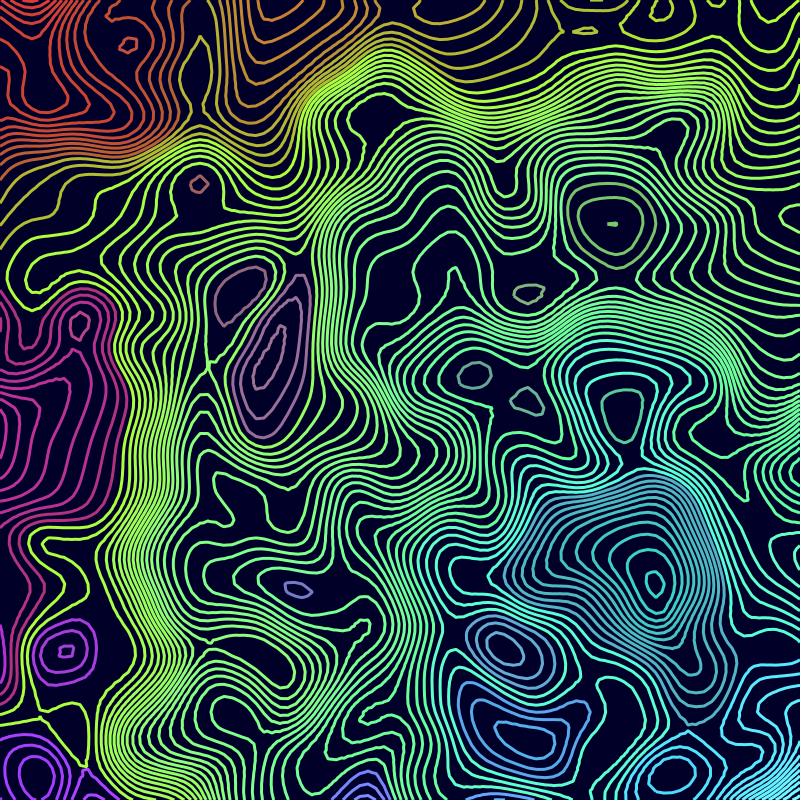
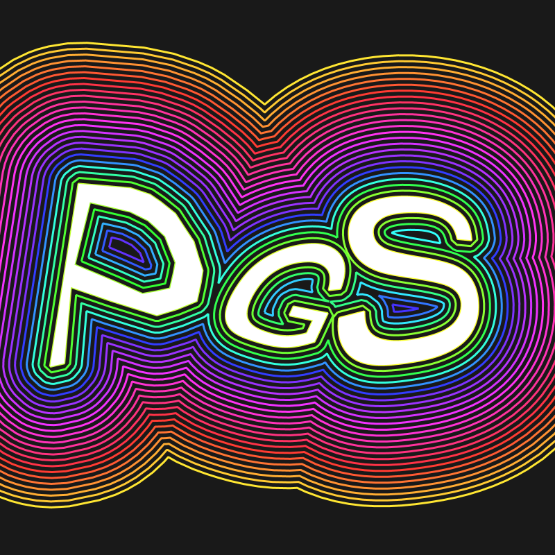

# Examples

A collection of example Processing sketches using *Processing Geometry Suite*. They should be able to be copy & pasted into and run immediately from the Processing IDE.

All examples are dynamic and/or interactive. Shown below are merely screenshots.

## blowUp

## contourMap

## drawOffsetCurves

## dysonHatching

## interlock

## intersectionBoids

## leafColoring

## letterParticles

## moireVoronoi

## minkShearLetters

## mosaic

## partitionSmooth

## ripplingTriangles

## organicSponge

## slice

## spiralOfSpirals

## spiralOutline

## textOffsetCurves

## tilePulse

## triangulate

## voronoiCutout

## warpedQuilt

